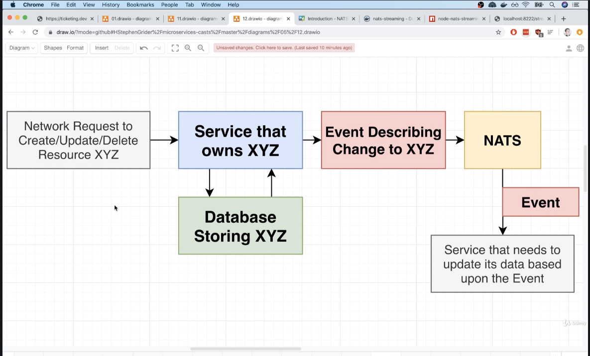
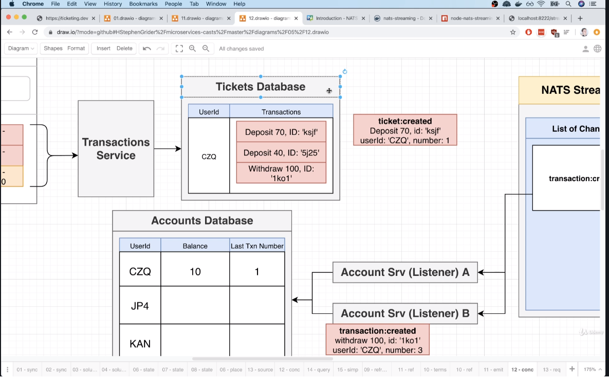

# GitTix (A Simple StubHub Clone): 

## Enhancements:

  - Instead of publishing event from services to NATS streaming directly, We should save the event in the db instance connected to the service, and then we could have something like a watcher (cronjob) that checks new events (with flag notPublished) in the service db and publish them to NATS.

  - For example:
  
    - Create a ticket scenario: 
    
    1. Create ticket object & event object in service DB (has collection for tickets and collection for events) [THIS SHOULD BE A DB TRANSACTION].
    2. Cronjob (watcher) polling the service's db for newly created events to publish them to NATS.

  - This eliminates data integrity issues that might arise if we created ticket object but failed to publish event for whatever reason. 

## DB Resources : 

  - Tickets
  - Users
  - Orders
  - Charges

In this app we will follow a resource-based microservice design, this basically means each resource will has its own microservice.
Of course a feature based design could be a better approach, but i am trying to start simple a t first.

## Microservices : 

  - Auth Service (sign-in, sign-out, sign-up)
  - Orders Service
  - Tickets Service
  - Expiration Service (Hanlde locking on orders)
  - Payments Service (using `stripe`)

This is a microservices application that uses `Async` communication between services, so it would be a great idea to list the events that we will work with through out the App.

## Events (Services use for Communication):

  - UserCreated
  - User Updated

  - OrderCreated
  - OrderCancelled
  - OrderExpired

  - TicketCreated
  - TicketUpdated

  - ChargeCreated

## Application Architecture Overview:

  We're going to use `Next.js` for client (`SSR`), and `mongodb` for other backend services, except expiration service, we are going to use `Redis`.

  Also, for the event bus server, we are going to use `NATS`.

  

## Kubernetes Cluster Config: 

  - We are going to use google cloud platform to deploy our cluster, also we'll use `skaffold` to handle all the syncing and building images by connecting it to `google cloud builder`

  - right now `kubectl` is now connected to our local cluster created by `minikube`, so we need to create another context that tells `kubectl` how to connect to the cluster we created on `gcp`.

  - To create a context for `kubectl`, we can use GCP UI or use [google-cloud-sdk](https://cloud.google.com/sdk). i will use the sdk : 
    - Step1: Download and install the SDK
    - Step2: run `gcloud auth login`, and login with your gcp account.
    - Step3: run `gcloud init` and configure the project containing the cluster (should be created from gcp ui)
    - Step4: run `gcloud container clusters get-credentials CLUSTER_NAME_ON_UI`, and this will create a context entry in kubectl config for the cluster we created on gcp.
    - Step5: check that cluster entry was added to local `kubectl` config by running `kubectl config view`
    - Step6: switch between different contexts using this command `kubectl config use-context CONTEXT_NAME`

## Password hashing Reminder : 
  - When a user tries to signup, hash password and save it to db.
  - When a user tries to sign in, we retrieve hashed password from db and match it to password he provided. 

## Is user Logged In (Microservices Architecture): 

  - How would we know if a user is authenticated in a microservices architecture? 

      - Approach 1.0 : services Sync with auth service (inspect JWT/Cookie in the auth service) - If Auth goes down, all service are down (the request will be like request ==> orders service ==> auth service)
      - Approach 1.1 : Auth service here acts as a gateway and all our requests has to pass through it. (the request will be like request ==> Auth service ==> orders service)
      - Approach 2.0 : Each service should be able to inspect the cookie or the JWT on its own. (No dependency on outer services.) but this has a downside, that we now don't see authorization (if user was banned in auth service).
      - We will implement approach 2 for the sake of separation between services
      - Solution to Approach 2.0 downside : always add expiration on cookies and jwt issued by auth service, when request comes to other services (handling auth logic by itself) and see that the jwt has expired then call auth srv for refresh token refresh or we could reject request with expired token.
      - What if the user is banned but the token is still active ? user/auth service should emit an event telling all services that a user is banned.(cached in mem for ex)

      
  Sometimes with each each request we could ask for user permission from auth server (if that was a requirement)

  - Browser handle cookie expiration, and a user could copy its content and use it. But JWT encode expiration in itself.
  - JWT is supported in all languages with official implementation, but cookies are not.
  - Cookies may require some backing datastores (for sessionID) but this is not required.
  - Remember Cookie is just a Transport mechanism that may be used for auth (we could use cookie and transport jwt via it).
  - Since we are implementing SSR React App, we will use cookies for transporting JWT (think about the first request you issue to the server, and you want to include some data in it (service workers with nextjs is a workaround if cookies are not prefered))

## Server Side Rendering: 

  - We are using `Next.JS` for SSR, It is convenient for SEO optimization and also saving up multiple requests (script tags in normal react app), and also better for mobile app.

  - `Next.JS` does not use `Reacr Router`, instead it rely on a folder called `pages`, and each file inside this folder maps to a route.

  - `getInitialsProps` is a special function used by nextjs to fetch data before rendering a component. Executed on the server.

  - REMINDER: in k8s, all services in the same namespace can communicate with each other via cluster ip service, if they lie in different namesapces, we should use a domain like this `http://NAMESPACE.SERVICENAME.svc.cluster.local`

  - External Name Service could be used to map a url mentioned above to a more simpler one.

  - `getInitialProps` executed on server: 1. Hard Refresh, 2.Clicking link from different domain, 3.Typing URL in address bar.
  - `getInitialProps` executed in browser: navigating to other page in same app.
  - This means when we make a request inside getInitialProps we must pay attention to whether it will be executed on server /client
  - Remember, GetInitialsProps arguments are different when used with PageComponent and a CustomApp Component

## NATS Streaming Server: 

  - docs.nats.io is the documentation for what we are going to use.

  - **Important Note**: `NATS` and `NATS Streaming Server` are two different things, NATS streaming server is built on top of NATS and gives some advanced functionality related to event sharing.

  - We are going to use the official `nats-streaming` image from docker hub.

  - Only raw data could be shared accross nats, so when sharing object, we should stringify it.

  - Nats server keeps record of each client connected to the server.

  - `Queue groups` are something that are created inside a `channel` (topic), and are used to deliver event/msg to only one member of the group (subscribers), so essentially what it does is prevent event from being processed by multiple subscribers of the same type(same logic). Also, if any other listener that is not in any QueueGroup, will recieve the event as well.

  - By default, when an event is recieved by the subscription, it will be marked as processed.

  - If manualAckMode is set to true, and the subscriber did not ack the event, the event will be sent back to nats server, and then sent to another(or same) instance in the queueGroup.

  - When a subscriber restarts, nats will hold the older subscribtion instance for a little period of time, and might also send events to it, whch will cause some events being delayed for processing. So some arguments may be used, like `hbi, hbt, hbf` to configure the client health check.

  - Another solution would to close client gracefully, but this one doesnot account for server failure (mimic it by killing process from task manager).

### Common Concurrency Issues:

  1. If a service fails to process event, and other events are processed on other services instances, this means events are processed out of order, which could be unacceptable depending on the business case.

  2. Maybe one listener(service) runs more quickly than another. Causing some events being processed out of order.

  3. Depending on hearbeat settings (and the service being shut unGracefully), NATS might think a dead service to be alive and send it an event to be processed, causing this event to be delayed.

  4. Race condition may occur caused by an event being processed twice. This could occur if one listener is very slow and is about to finish in 29.999s (NATS consider event as failed after 30s and did not recieve ack from service). So after 1ms NATS consider the event as failed and send it to be processed again, while the first service is still (probably finished processing) processing the event.

  #### Common Questions: 

    1. Are concurrency issues related only to Microservices Architecture? No. it occurs also in Monolith apps, but it's just more prominent in MicroServices Arch.

    2. Why not run one instance of the listener server? Still the same issue (processing out of order) might occur, and we end up with a bottleneck in our application that we are not able to scale.

    3. Could we share state between listener services (SRV-1 => cache/Queue <= SRV-2) and check events sequence number? This solution might seem good, but it strictly process events in sequence and this might be a penalty, if we for example have a multitenant system, tenant(B) is independent from tenant(A), and yet we are processing their events sequencially rather than concurrently, also this issue might occur on one-tenant level application, if we are updating two different records for example. [One Update At A Time]

    4. Building on the Idea above, Could we check last processed event by the event # and also the resourceId (or tenantId+resourceId) ? This solution is good (having pool of sequence queues based on resources, in other words, queue per resource that is updated by events) (Meaning, if events are updating 2 resources, we could have one queue for each resource). But we have an issue related to NATS, and that is, the repeated numbering of events is not allowed in the same channel, so we might end up creating many channels which introduces an overhead.

    5. A possible solution might be built upon the previous idea, but now the publisher will save the event data.
    The Steps are: VIDEO{285}
      a. Pub send event to `NATS`.
      
      b. `NATS` send event `seqNum` back to `publisher`, and pub saves this event( `seqNum`, `payload`, `lastSeq` (not used yet) ).

      c. `NATS` forward this event to a `listener`, then it gets processed, and in the database of the `listener`, we check the `lastSeq` attribute of the incoming event and see if it matches the `lastEventIDProcessed` for the resource, then process the event, and finally, we save the `seqNum` of the incoming event as `lastEventIDProcessed` for the resource being updated.

      d. When another event is being published for the same resource (identified by event payload that might have resourceId) publisher checks its database for the last event for this resource, and assign this last event's `seqNum` to the new event's `lastSeq` attribute.

      e. Steps a, b, c are repeated.
    
    NOTE: NATS really does not send he seqNum back, so this solution might work with other solution other than NATS. This could be solved by relying on numbering being from publisher itself.

  #### A solution:
    - Re-design the services again - We did not mention anything about the publisher, and began to design based only on NATS.
    - But if we take a closer look at publisher service, we know that it needs a database to save the requests/resources it recieves. So, we could rely on numbering these requests as they come and use this transactionNumber as our indicator for events sequence.
    - Also, the listener's database still has the `lastEventNumber` but it now corresponds to the transactionNumber in the publisher service. And the logic should check this `lastEventNumber` before any processing.

    - So, numbering the transactions or events as they come and make the consumers aware of this numbering, solves the ordering of events problem we had previously.

    
    
  
## Event Re-Delivery:

  - All events are saved by NATS in an event-history.
  - We can replay all events when a subscription is created by manipulating the subOpts obj. or only run lastDelivered.

## Durable Subscribtion:

  - Is created when we create a subscribtion with `setDurableName` on the subOpts object.
  - It means that a subscribtion has recieved and processed an event successfully. So if the service goes down, NATS will send only the events that subscribtion has missed out during its time down.(when used with `setDeliverAllAvail`).
  - Using queueGroups, will make sure that if a client is disconnected, NATS will not delete the subscribtion

## Common Module Note: 

  - We have written a common module (npm package) that includes all errors and common middlewares and also all the events that the services communicate with. But this solution is only feasible if all the services are written in typescript.

  - if we have a polygot architecture (using different languages i different services) and want to enforce something like events structure, we could use: 

    - JSON schema.
    - Protobuf.
    - Apache Avro