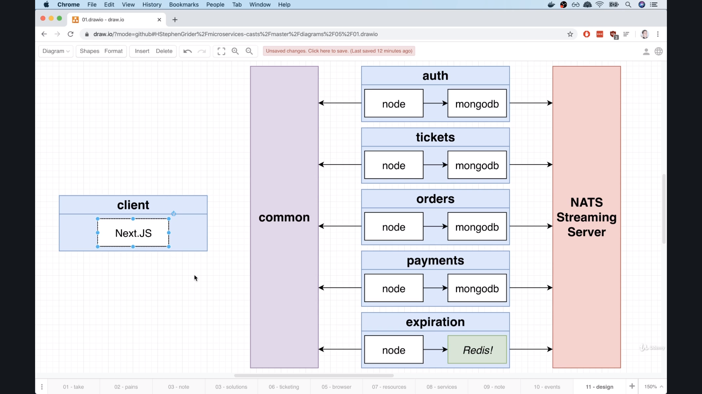

# GitTix (A Simple StubHub Clone): 

## DB Resources : 

  - Tickets
  - Users
  - Orders
  - Charges

In this app we will follow a resource-based microservice design, this basically means each resource will has its own microservice.
Of course a feature based design could be a better approach, but i am trying to start simple a t first.

## Microservices : 

  - Auth Service (sign-in, sign-out, sign-up)
  - Orders Service
  - Tickets Service
  - Expiration Service (Hanlde locking on orders)
  - Payments Service (using `stripe`)

This is a microservices application that uses `Async` communication between services, so it would be a great idea to list the events that we will work with through out the App.

## Events (Services use for Communication):

  - UserCreated
  - User Updated

  - OrderCreated
  - OrderCancelled
  - OrderExpired

  - TicketCreated
  - TicketUpdated

  - ChargeCreated

## Application Architecture Overview:

  We're going to use `Next.js` for client (`SSR`), and `mongodb` for other backend services, except expiration service, we are going to use `Redis`.

  Also, for the event bus server, we are going to use `NATS`.

  

## Kubernetes Cluster Config: 

  - We are going to use google cloud platform to deploy our cluster, also we'll use `skaffold` to handle all the syncing and building images by connecting it to `google cloud builder`

  - right now `kubectl` is now connected to our local cluster created by `minikube`, so we need to create another context that tells `kubectl` how to connect to the cluster we created on `gcp`.

  - To create a context for `kubectl`, we can use GCP UI or use [google-cloud-sdk](https://cloud.google.com/sdk). i will use the sdk : 
    - Step1: Download and install the SDK
    - Step2: run `gcloud auth login`, and login with your gcp account.
    - Step3: run `gcloud init` and configure the project containing the cluster (should be created from gcp ui)
    - Step4: run `gcloud container clusters get-credentials CLUSTER_NAME_ON_UI`, and this will create a context entry in kubectl config for the cluster we created on gcp.
    - Step5: check that cluster entry was added to local `kubectl` config by running `kubectl config view`
    - Step6: switch between different contexts using this command `kubectl config use-context CONTEXT_NAME`

  